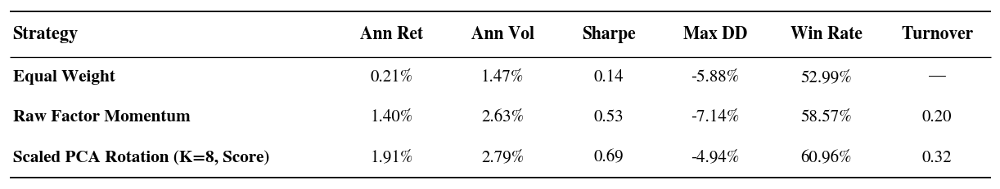
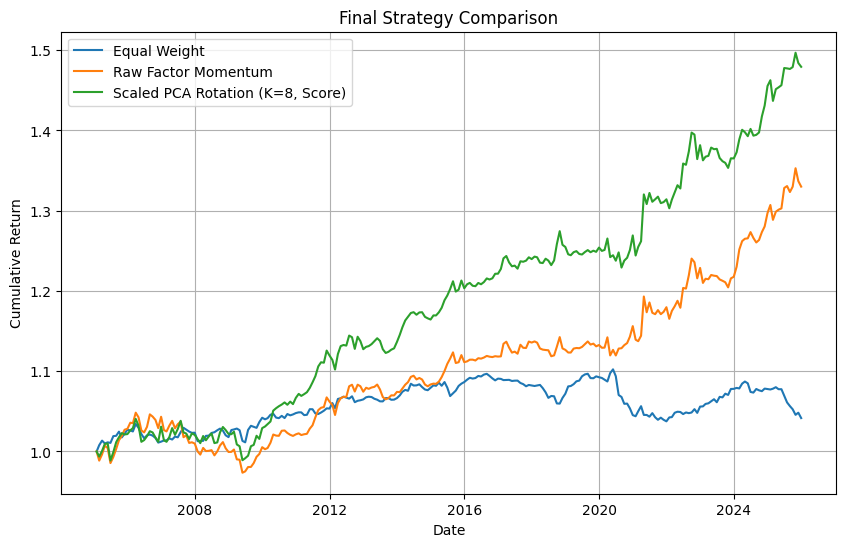
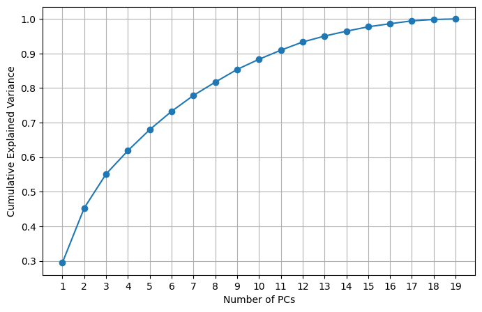
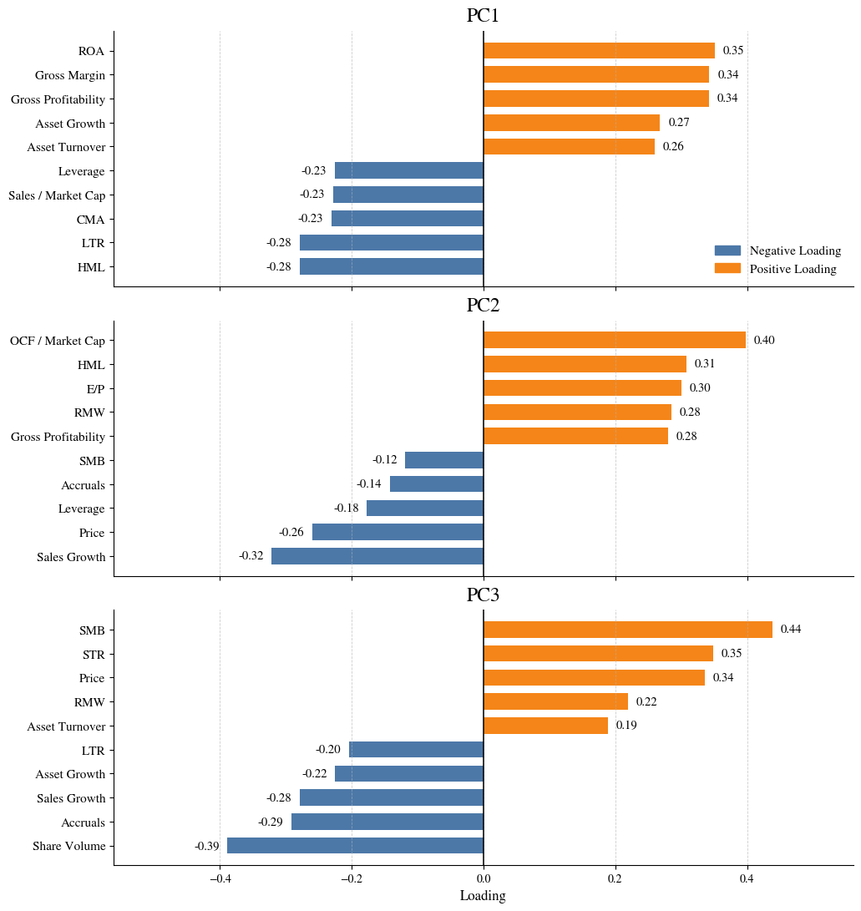
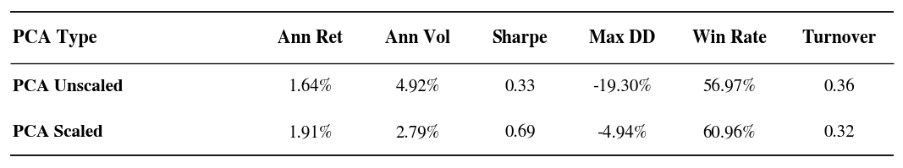

# Scaled PCA Factor Rotation Strategy

## 1. Overview
This project studies whether factor momentum can be improved by applying momentum signals to latent principal-component factor portfolios rather than directly to raw factors.

## 2. Motivation
Raw factor momentum directly applies trend-following signals to individual factor returns. However, many factors are correlated and may represent overlapping investment themes. Applying momentum to each raw factor separately may therefore lead to redundant or unstable exposures.

## 3. Data
- **Data:** Taiwan stock data (Monthly)  
- **Source:** TEJ (Taiwan Economic Journal)  
- **Time Period:** 1981-01-01 to 2025-12-31

## 4. Factor Construction
1. Each firm characteristic $c_{i,t}$, is first transformed into a cross-sectional rank, and then centered around zero and normalized by the sum of absolute deviations
from the mean

$$
\begin{aligned}
w_{i,t} = \frac{r c_{i,t} - \bar{r c_{i,t}}}{\sum_{i=1}^{n_{t}} |rc_{i,t} - \bar{rc}_{i,t}|}
\end{aligned}
$$

- where $rc_{i,t} = \frac{rank(c_{i,t})}{n_{t} + 1}$, $n_{t}$ is the number of stocks in month t

2. The month t return on a factor based on characteristic $j$ is $f_{t} = \sum_{i = 1}^{n_{t}} w_{i,t−1} r_{i,t}$

- To avoid look-ahead bias:
  - Portfolio weights are shifted forward by one month
  - Financial statement variables are not assumed to be tradable immediately on the announcement date, they are assumed to become tradable only from the following month

## 5. Factors
- **Financial Statement Characteristics**
  - Gross profitability
  - ROA
  - Leverage
  - Accruals
  - Sales growth
  - Asset growth
  - Asset turnover
  - Gross margin
  - Operating cash flow / market capitalization
  - Sales / market capitalization

- **Price-volume characteristics**
  - Price
  - Share volume

- **TEJ factors**
  - SMB
  - HML
  - E/P
  - RMW
  - CMA
  - STR
  - LTR

Note: ROE is excluded from the final factor panel because it is highly correlated with ROA and tends to be more volatile.

## 6. Methodology

### 6.1 Scaled PCA
- Let $f_t \in \mathbb{R}^N$ denote the vector of raw factor returns in month $t$
- $D_\sigma$ be the diagonal matrix of training-period factor standard deviations
- The scaled factor return is:  $\tilde f_t = f_t D_\sigma^{-1}$

PCA is estimated from the covariance matrix of scaled returns:

$$
\begin{aligned}
\Sigma_{\tilde f} = Cov(\tilde f_t)\\\\
\Sigma_{\tilde f} q_k^{scaled} = \lambda_k q_k^{scaled}
\end{aligned}
$$

Since $q_k^{scaled}$ is estimated in scaled-return space, it is not directly a raw factor portfolio weight. To construct tradable PC portfolio returns using raw factor returns, the loading is mapped back to raw-return space:

$$
\begin{aligned}
q_k^{raw} = D_\sigma^{-1} q_k^{scaled}
\end{aligned}
$$

Therefore, the PC portfolio return is:

$$
\begin{aligned}
PC_{k,t} = f_t q_k^{raw}
\end{aligned}
$$

### 6.2 PC Allocation
For the $k$-th principal component ($PC_k$), the signal in month $t$ is defined as the cumulative PC portfolio return over the past 12 months:

$$
\begin{aligned}
s_{k,t} = \sum_{\ell=1}^{12} PC_{k,t-\ell}
\end{aligned}
$$

- No-Look-Ahead Bias: Formulating the strategy at month $t$ uses only completed data up to $t-1$

Allocation for $PC_k$:

$$
\begin{aligned}
a_{k,t} = \frac{s_{k,t}}{\sum_{m=1}^{K} |s_{m,t}|}
\end{aligned}
$$

### 6.3 PC Weight to Factor Weight
Let $Q_K^{raw}$ denote the matrix of the first $K$ raw-space PC loadings:

$$
\begin{aligned}
Q_K^{raw} = D_\sigma^{-1} Q_K^{scaled}
\end{aligned}
$$

PC-level weights are mapped back to the original factor space by:

$$
\begin{aligned}
w^{factor}_t = a^{PC}_t (Q_K^{raw})^T
\end{aligned}
$$

The resulting factor weights are normalized by gross exposure:

$$
\begin{aligned}
\tilde w^{factor}_t = \frac{w^{factor}_t}{\sum_{j=1}^{N} |w^{factor}_{j,t}|}
\end{aligned}
$$

The strategy return in month $t+1$ is then computed using raw factor returns:

$$
\begin{aligned}
R_{t+1}^{strategy} = \tilde w_t^{factor} f_{t+1}^T
\end{aligned}
$$

## 7. Strategy Design
- Time-Series Split:
  - Training Period: 1983-01-31 to 2005-01-31 (First half of the sample)
  - Testing Period: 2005-02-28 to 2025-12-31 (Second half of the sample)

- The final specification is selected based on the robustness analysis:
  - PCA type: Volatility-scaled PCA
  - Number of PCs: $K = 8$
  - Lookback window: 12 months
  - Weighting rule: Score weighting

## 8. Main Results

### Table 1 - Summary
During the out-of-sample period, the scaled PCA factor rotation strategy achieves higher annualized return, higher Sharpe ratio, lower maximum drawdown, and higher win rate than raw factor momentum. The improvement comes at the cost of higher factor allocation turnover.

- Note: Turnover refers to average factor allocation turnover, computed as the average absolute month-to-month change in factor weights.

### Figure 1 - Cumulative Return Plot

### Figure 2 - Cumulative Explained Variance Plot

### Figure 3 - PC1-PC3 Top Loadings Plot
- **PC1** mainly captures a profitability / quality-related theme
- **PC2** is more associated with value, cash-flow, and profitability characteristics
- **PC3** reflects a more mixed size / trading-style component

## 9. Robustness
1. Number of principal components
- K = 1, 3, 5, 8
- Performance improves when more PCs are included, with $K=8$ delivering the strongest results among the tested settings.

2. Lookback window
- 3, 6, and 12 months
- 6-month and 12-month lookbacks deliver similar results, while the 12-month window is used in the final specification for consistency with the factor momentum literature.

3. Weighting rule
- Sign weighting vs score weighting
- Score weighting performs better, suggesting that the magnitude of PC momentum signals contains useful information.

4. PCA type
- Scaled PCA vs unscaled covariance PCA
- Scaled PCA improves Sharpe ratio, win rate, and maximum drawdown relative to unscaled PCA.

  **(Table 2)** Summary of PCA type

  

  - Note: Results use $K=8$, a 12-month lookback window, and score-based PC allocation.

## 10. Key Findings
1. Scaled PCA factor rotation further improves Sharpe ratio and maximum drawdown relative to raw factor momentum.
2. Scaling factor returns before PCA produces more stable principal components and better risk-adjusted performance than unscaled covariance PCA.
3. Score-based PC allocation outperforms sign-based allocation, suggesting that signal strength matters.
4. The final PCA strategy has higher turnover, so transaction cost sensitivity remains an important extension.

## 11. Future Work
1.  A rolling or expanding PCA estimation scheme could be considered in future work.
2. Construct the entire factor universe using fully transparent, self-built stock-level portfolios. This enables mapping factor weights back into physical individual stock weights, allowing for realistic transaction cost modeling, turnover penalties, and direct execution deployment.

## References
- Sina Ehsani, Juhani T. Linnainmaa(2022). Factor Momentum and the Momentum Factor. The Journal of Finance, VOL. LXXVII, NO. 3, 1877-1919
- Valentin Haddad, Serhiy Kozak and Shrihari Santosh(2020). Factor Timing. The Review of Financial Studies 33,  1980–2018